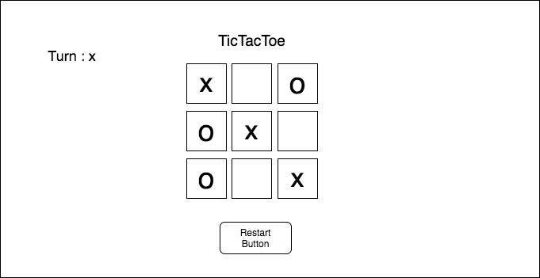

# Tic Tac Toe

Play **Tic Tac Toe**, also known as X and O. The game can  have **TWO** players to play.

## Wireframe

## User Stories

* As Player, I want to be able to show turns e.g x turn
* As player, I want to be able to restart the game
* As Player, I want to be able to add X and O on cells
* As Player, I want to be able to show win, lose and tie as message
* As Player, I do not want the player to add an O in already taken cells from X  
* As Player,  I want to be able to play game again without refreshing the page
* As Player, I want to be able to play on phone devices

## Technologies Used

* HTML  (Hypertext Markup Language)
* CSS
* Javascript
* Develpoer tools
* Visual studio

## Solving Strategy

 Strategy is to give every cell an ID e.g ( 0 for first cell and 1 for the second one ) and so on and then when I use get attribute it should return me the cell I want in board to check for winner.

## Future Features

* I will create an AI opponent: teach JavaScript to play an unbeatable game against you
* I will use localStorage to persist data locally to allow games to continue after page refresh or loss of internet connectivity

## Resouces

* W3school
* MDN JavaScript Docs
